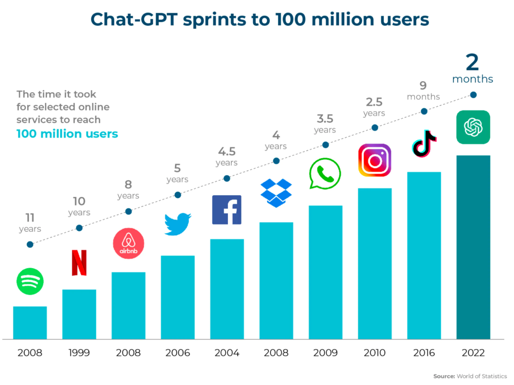
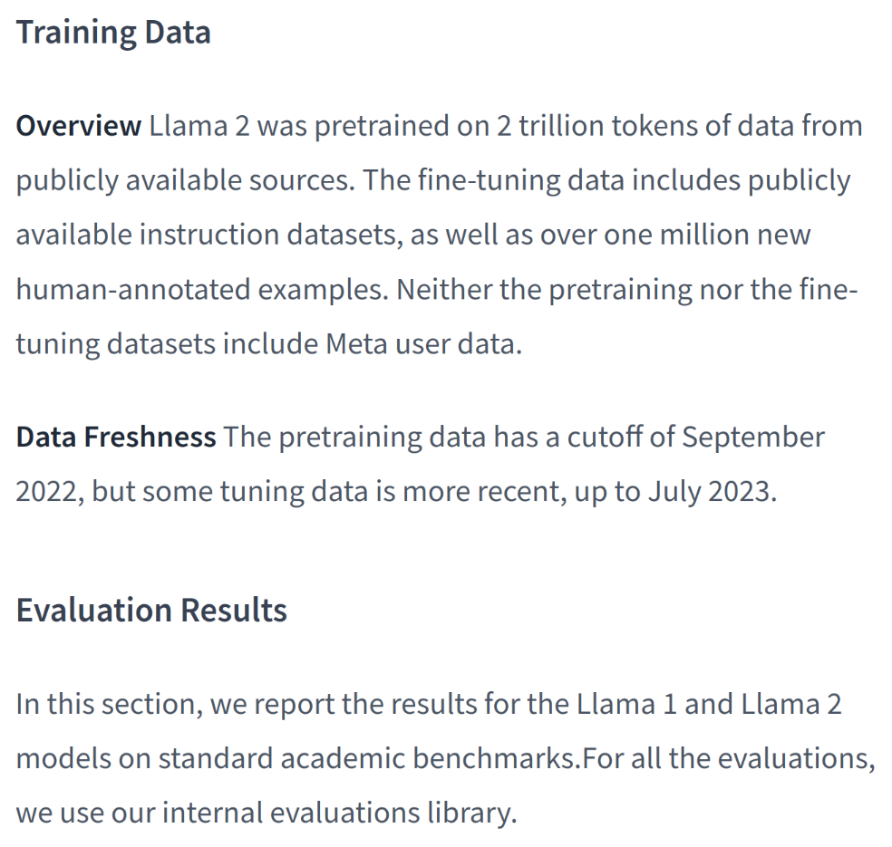
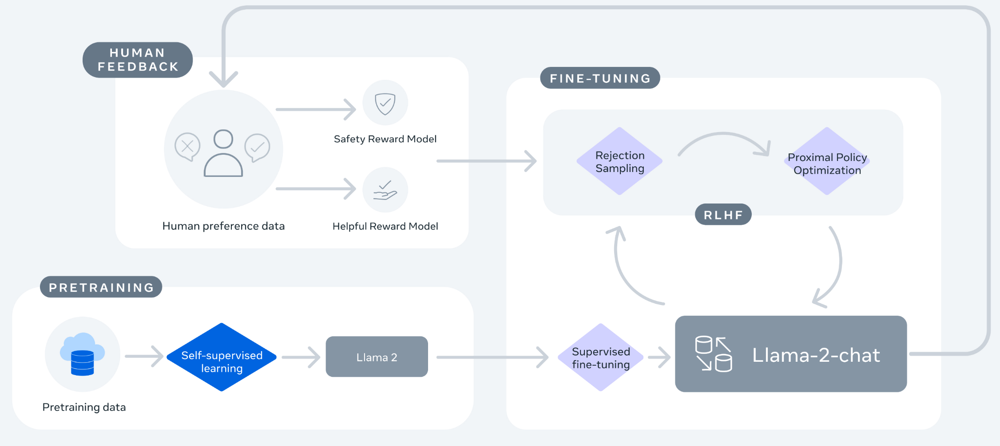
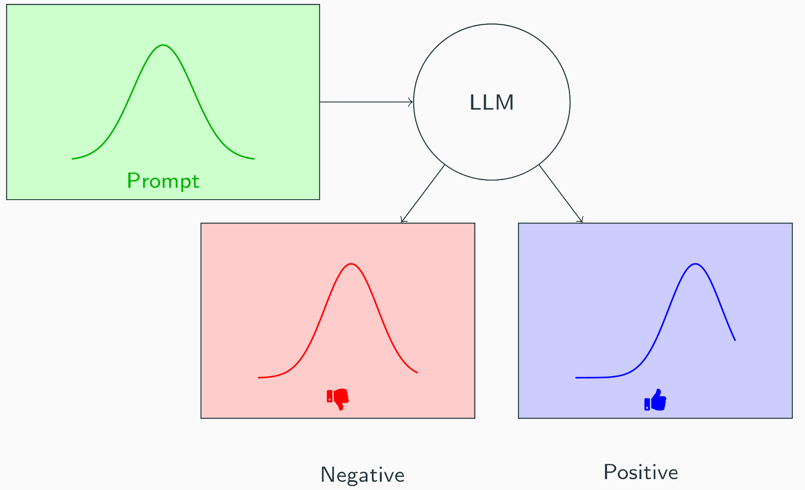
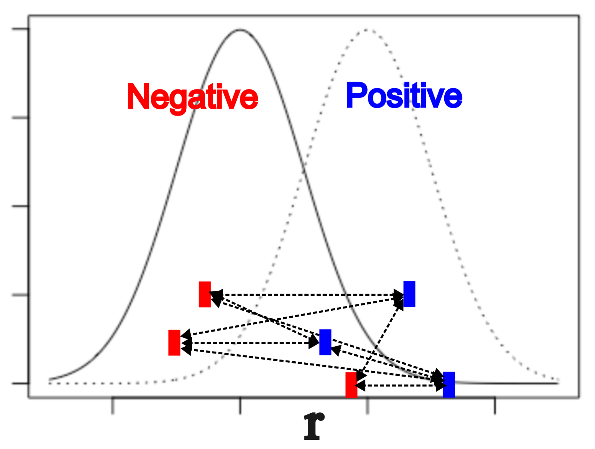

# A talk on Large Language Models?

## LLMs in society {auto-animate="true"}

:::: {.columns}
::: {.column width=60% .fragment}
* Rapidly became a **pervasive technology** in how we consume and produce information

{ width=90% }
:::
::: {.column width=40% .fragment}
* Huge attention by financial markets

)](./2025-INI-DistributionalHumanPreferences_files/img/nvidia_600B_loss.png){ width=90% }
:::
::::

## LLMs in science {auto-animate="true"}

:::: {.columns}
::: {.column width=50% }
{ width=80% }

:::
::: {.column width=50% }
* Changing how science is being conducted
 

::: {.fragment}
* For good or for bad 

{ width=80% }
:::
:::
::::

## LLM development lifecycle {auto-animate="true"}

:::: {.columns}
::: {.column width=50%}

](./2025-INI-DistributionalHumanPreferences_files/img/llm_dev_lifecycle.png){ width=100% }

::: {.fragment}
* **pre-training**: self-supervised autoregression on uncurated internet-scale data
  * *compute intensive, costly, autocompletion*
  * acquisition of **knowledge** ([**good**]{style="color:blue;"} \& [**bad**]{style="color:red;"})
  * acquisition of **capabilities** ([**good**]{style="color:blue;"} \& [**bad**]{style="color:red;"})
:::
:::
::: {.column width=50% }
::: {.r-stack}
{ width=80% .fragment}

{ width=90% .fragment}

{ width=100% .fragment}

{ width=100% .fragment }
:::
:::
::::

## LLM development lifecycle {auto-animate="true"}

:::: {.columns}
::: {.column width=50%}

](./2025-INI-DistributionalHumanPreferences_files/img/llm_dev_lifecycle.png){ width=100% }

* **pre-training**: self-supervised autoregression on uncurated internet-scale data
  * *compute intensive, costly, autocompletion*
  * acquisition of **knowledge** ([**good**]{style="color:blue;"} \& [**bad**]{style="color:red;"})
  * acquisition of **capabilities** ([**good**]{style="color:blue;"} \& [**bad**]{style="color:red;"})
* **post-training**: *Instruction finetuning* and *Alignment*
  * **suppress** the bad 👎
  * **"elicit"** the good 👍

:::
::: {.column width=50%}
:::{.incremental}
* **Alignment:** Adapting model to human preferences
  * *Questions for neuroscience: **How should we model human preferences?*** → question that should be answered by *neuroscientists*, *cognitive psychologists* and *behavioral economists*
  * *Answers for neuroscience: **AI as a theoretical tool for cognitive science*** [@VanRooij2023], e.g. to understand and predict sequential decisions [@Nguyen2024]
  * *Questions for everyone: **Broaden discussion on ethical \& socio-technical implications***: Who should decide how to align AI, and how? For instance, about questions around censorship and bias
:::
:::
::::

## LLM development lifecycle {auto-animate="true"}

:::: {.columns}
::: {.column width=50%}

](./2025-INI-DistributionalHumanPreferences_files/img/llm_dev_lifecycle.png){ width=100% }

* **pre-training**: self-supervised on uncurated internet-scale data
  * *compute intensive, costly*
  * acquisition of **knowledge** ([**good**]{style="color:blue;"} \& [**bad**]{style="color:red;"})
  * acquisition of **capabilities** ([**good**]{style="color:blue;"} \& [**bad**]{style="color:red;"})
* **post-training**: *Instruction finetuning* and *Alignment*
  * **suppress** the bad 👎
  * **"elicit"** the good 👍

:::
::: {.column width=50%}
* **Alignment:** Adapting model to human preferences
  * alignment has been characterized as a "jail" for LLMs
  * recently the *opposite* idea that post-training unleashes and "elicits" latent knowledge and capabilities has been gaining traction

:::{.r-stack}
{ width=60% }

{ width=100% .fragment}
:::
:::
::::

# Training LLMs

## LLM training: pretraining and supervised fine-tuning {auto-animate=true}

:::: {.columns}
::: {.column width=75%}

::: {data-id="fig4"}
![[@Touvron2023]](KAIST-DistributionalHumanPreferences_files/img/llama2_fig4.png){ width=100% }
:::

:::
::: {.column width=25%}

<figure style="margin-top: -2cm;">
{ width=100% }
 </figure>

:::
::::

:::: {.columns}
::: {.column width=50%}

::: {.fragment}

LLaMa2 after PRETRAINING
{ width=90% }

:::

:::
::: {.column width=50%}

::: {.fragment}

LLaMa2 after SUPERVISED FINE-TUNING
{ width=90% }

:::

:::
::::

## LLM training: Reinforcement Learning from Human Feedback (RLHF) {auto-animate=true}

:::: {.columns}
::: {.column width=35%}

* **Risks:** Biased, unethical, harmful content at scale

{ width=100% }

:::
::: {.column width=65%}

::: {data-id="fig4"}
 

RLHF to the rescue
{ width=100% }

:::
:::
::::
* RLHF tries to align LLMs with human preferences by making use of reward model
* **Reward models** are themselves trained on human preference data
* Therefore they embody the biases and inclinations of the human annotators and model builders

{.absolute top=-700 left=00 height="380" .fragment}

{.absolute top=-1100 left=00 height="340" .fragment}

# Alignment algorithms

## Reinforcement Learning from Human Feedback (RLHF) \& Reward Models {auto-animate=true}

{ width=60% }

RLHF (@Ouyang2022) consists in:

1. gathering preference data (responses annotated by humans)
2. training of a **Reward Model** $r(x,y)$ fitting human preferences of response $y$ given prompt $x$
3. using RL to find a policy that maximizes the learned reward

::: {.fragment}
Convergence of two bodies of work:

* **training language models with RL** + **learning from human preferences**
:::

## RLHF formalism

* Find a policy that maximizes a reward $r$ while staying close to a reference policy $\pi_{\mathrm{ref}}$:
$$\max_{\pi_\theta} \mathbb{E}_{x\sim\mathcal{D},y\sim\pi_\theta(y|x)} \left[r(x,y)\right] -\beta \mathsf{KL}(\pi_{\theta}(y|x) || \pi_{\mathrm{ref}}(y|x))$$

::: {.incremental}
* **Observation:** The optimal policy can be solved in closed form:
$$\pi _\theta(y|x) =\frac{1}{Z(x)} \pi _{\mathrm{ref}}(y|x) \exp\left( \frac{1}{\beta}r(x,y)\right)$$
  * Solving for $r$ we get:
$$r_{\theta}(x,y) = \beta \log \frac{\pi_{\theta}(y|x)}{\pi_{\mathrm{ref}}(y|x)} + \beta \log(Z(x))$$
  * This relation says that a policy $\pi_\theta$ implicitly is also a reward model $r_\theta$
  * Maybe we can avoid training an independent reward model when optimizing the policy?
  * For that we need to 1) define an optimization objective, and 2) get rid of the normalization term $Z(x)$
:::

## Avoiding RL with Direct Preference Optimization (DPO)

DPO [@Rafailov2023] directly optimizes the policy, sidestepping reward model training

* Solve previous eq. for $r$
$$r_{\theta}(x,y) = \beta \log \frac{\pi_{\theta}(y|x)}{\pi_{\mathrm{ref}}(y|x)} + \beta \log(Z(x))$$

::: {.fragment }
* **Paired preference dataset: $(x,y_+,y_-) \sim \mu$**
  * $y_+$: positive (chosen) response
  * $y_-$: negative (rejected) response
:::
::: {.incremental }
* **Bradley-Terry preference model** given ground-truth reward $r^*(x,y)$:
  * $p^*(y_+ \succ y_-|x) = \sigma\left( r^*(x,y_+) - r^*(x,y_-) \right)$
  * $p^*(y_+ \succ y_-|x) = \sigma\left( \beta \log\left( \frac{\pi^*(y_+|x)}{\pi_{\mathrm{ref}}(y_+|x)} \right) - \beta \log\left( \frac{\pi^*(y_-|x)}{\pi_{\mathrm{ref}}(y_-|x)} \right)  \right)$ (normalization $Z(x)$ cancels out)
  * We can optimize through maximum likelihood!
:::

## DPO interpretations

::: {.incremental }
* DPO: maximum likelihood of $p^*(y_+ \succ y_-|x) = \sigma\left( \beta \log\left( \frac{\pi^*(y_+|x)}{\pi_{\mathrm{ref}}(y_+|x)} \right) - \beta \log\left( \frac{\pi^*(y_-|x)}{\pi_{\mathrm{ref}}(y_-|x)} \right)  \right)$
* Minimize the logarithmic sigmoid **loss**:
  * $-\min _{\theta \in \Theta} \mathbb{E}_{(x,y_{+},y_{-}) \sim \mu} \log \left(\sigma\left( \beta \log\left( \frac{\pi_{\theta}(y_+|x)}{\pi_{\mathrm{ref}}(y_+|x)} \right) - \beta \log\left( \frac{\pi_{\theta}(y_-|x)}{\pi_{\mathrm{ref}}(y_-|x)} \right)  \right)\right)$
:::
::: {.fragment }
* Interpretation as pointwise preference:
$$\fbox{$\log\left( \frac{\pi_{\theta}(y_+|x)}{\pi_{\mathrm{ref}}(y_+|x)} \right) \geq \log\left( \frac{\pi_{\theta}(y_-|x)}{\pi_{\mathrm{ref}}(y_-|x)} \right), \quad \forall (x,y_+,y_-) \sim \mu.$}$$

  * This formulation suggests other algorithms e.g. replacing sigmoid with hinge loss [SLiC, @Zhao2022]
:::

## Pointwise preference {auto-animate="true" auto-animate-easing="ease-in-out"}

:::: {.columns}
::: {.column width=50%}

::: {data-id="fig_d"}

{ width=80% }

:::

::: {data-id="eq1"}
$$\fbox{$\color{blue}{\log\left( \frac{\pi_{\theta}(y_+|x)}{\pi_{\mathrm{ref}}(y_+|x)} \right)} \geq \color{red}{\log\left( \frac{\pi_{\theta}(y_-|x)}{\pi_{\mathrm{ref}}(y_-|x)} \right)} $}$$
:::

:::
::: {.column width=50%}

::: {.incremental}
Problems with Bradley-Terry Pointwise Preference:

1. **Paired** positive and negative responses for each prompt are needed
2. Provided pairs are sparse (only a fraction of all possible pairs)

{ width=60% }

* What we want is to compare the full distributions
:::

:::
::::

## Distributional preference {auto-animate="true" auto-animate-easing="ease-in-out"}

:::: {.columns}
::: {.column width=50%}

::: {data-id="fig_d"}

{ width=100% }

:::

::: {data-id="eq1"}
$$\fbox{$\color{blue}{\log\left( \frac{\pi_{\theta}(y_+|x_+)}{\pi_{\mathrm{ref}}(y_+|x_+)} \right)} \underset{\text{FSD}}{\succcurlyeq} \color{red}{\log\left( \frac{\pi_{\theta}(y_-|x_-)}{\pi_{\mathrm{ref}}(y_-|x_-)} \right)} $}$$
:::

::: {.fragment data-fragment-index="2"}
* No need for **paired** *positive* and *negative* answers!
* "All" negative samples compared to all positives
:::

:::
::: {.column width=50%}

* **Goal:** Compare whole distribution of negative responses and distribution of positive responses

::: {.fragment data-fragment-index="1"}
* **Stochastic Dominance** is a framework that allows for comparison of distributions

::: {.callout-tip}
## Definition: First Order Stochastic Dominance (FSD)

Given two random variables $Z_1$ and $Z_2$, $Z_1$ is said to dominate $Z_2$ in the first order if $Z_1$ has larger quantiles than $Z_2$ for all percentiles $p$:
$$Z_1 \underset{\text{FSD}}{\succcurlyeq} Z_2 \iff Q_{Z_1}(p) \geq Q_{Z_2}(p), \quad \forall p \in [0,1].$$
where the quantile function $Q_Z(p)$ is 
$Q_Z(p) = CDF^{(-1)}_Z(p).$
:::

{ width=60% }

:::

:::
::::

 

## Distributional Unpaired Preference

* No access to triplets of prompts and positive/negative responses $(x,y_+,y_-)$
* Separate access to:
  - $\mu_{+} \in \mathcal{P}(\mathcal{X} \times \mathcal{Y})$: Distribution of **positive** prompt-response pairs $(x_+,y_+)$ with *high reward*
  - $\mu_{-} \in \mathcal{P}(\mathcal{X} \times \mathcal{Y})$: Distribution of **negative** prompt-response $(x_-,y_-)$ with *low reward*

::: {.callout-tip}
## Definition: Distributional Preference in the Unpaired Setting

A policy $\pi$ prefers distributionally $\mu_+$ over $\mu_-$ with respect to a reference policy $\pi_{\mathrm{ref}}$ if:

$$
\log \frac{\pi_{\theta}(y_+|x_+) }{\pi_{\mathrm{ref}}(y_+|x_+)} \underset{ \text{FSD }}{\succcurlyeq} \log  \frac{\pi_{\theta}(y_-|x_-)}{\pi_{\mathrm{ref}}(y_-|x_-)}.
$$
In other words, noting $r_u \circ \pi_{\theta}(x,y) = \log \frac{\pi_{\theta}(y|x) }{\pi_{\mathrm{ref}}(y|x)}$, the distributional preference in the unpaired setting means that we have the following constraint:
$$
(r_u \circ \pi_{\theta})_{\sharp} \mu_+ \underset{ \text{FSD }}{\succcurlyeq} (r_u \circ \pi_{\theta})_{\sharp} \mu_-.
$$
:::

## Alignment with Distributional Unpaired Preference

* **Goal**: Align a policy $\pi_{\theta}$ with a distributional unpaired preferences of *preferred* $(x_+,y_+)\sim\mu_+$ and *unpreferred* $(x_-,y_-)\sim\mu_-$ samples
 
::: {.incremental}
* **Optimization problem:** Find $\pi _\theta\in\mathcal{H}$ such that:
$\quad(r_u \circ \pi_{\theta})_{\sharp} \mu_+ \underset{ \text{FSD }}{\succcurlyeq} (r_u \circ \pi_{\theta})_{\sharp} \mu_-$

* **Definition of FSD:**
$\qquad U_{\theta} \underset{\text{FSD }}{\succcurlyeq} V_{\theta} \iff Q_{U_{\theta}} (t) \geq   Q_{V_{\theta}} (t), \qquad \forall t \in [0,1]$

* Relax this problem to minimizing the violation of the FSD order:
$$
\min_{\theta \in \Theta}\varepsilon(\theta) := \int_{0}^{1} h \left(  Q_{U_{\theta}} (t) - Q_{V_{\theta}} (t) \right)dt,
$$
where $h$ penalizes the violations of dominance of $U_{\theta}$ on $V_{\theta}$.
  * some possibilities for $h$:
    - indicator Loss: $h(x)=\mathbb{1}_{x < 0}$
    - $\beta$-squared Hinge Loss: for a margin $\beta > 0$, $h(x) = (\beta - x)^2_+$
    - $\beta$-logistic Loss: $h(x) = \log(1 + \exp(-\beta x))$
    - $\beta$-Least Squares[^1]: $h(x) = (\beta - x)^2$
:::

[^1]: Although not a convex relaxation of the 0/1 loss, the least squares loss has been used in classification (for alignment, it was used in IPO by @Azar2023)

## Quantile Violation as an Optimal Transport Problem

::: {.callout-tip}
## Theorem 2.9 and Proposition 2.17 in @Santambrogio2015

Let $h :\mathbb{R}\to \mathbb{R}^+$ be a convex function we have for two real random variables $U,V$, with measures
 $\mu_{U},\mu_{V}$: 
$$
\int_{0}^1 h\left( Q_{U} (t) - Q_{V} (t) \right) dt  = \min _{\gamma \in \Pi(\mu_{U},\mu_{V})} \int h(u-v) d\gamma(u,v) = \mathsf{OT}_{h}\left(\mu_{U},\mu_{V}\right)
$$
and $\gamma^*=(Q_{U}, Q_{V} )_{\sharp} \mathcal{L}_1([0,1])$ is a minimizer (where $\mathcal{L}_1$ is the Lebesgue measure on $[0,1]$ ). If furthermore $h$ is strictly convex $\gamma^*$ is the unique minimizer.
:::

::: {.fragment}
This says that we have to solve an optimization problem with an inner 1D Optimal Transport problem with smooth convex cost:
$$
\min_{\theta \in \Theta} \int_{0}^{1} h (  Q_{U_{\theta}} (t) - Q_{V_{\theta}} (t)  )dt =\min_{\theta \in \Theta}  \mathsf{OT}_{h}(\mu_{U_{\theta}},\mu_{V_{\theta}}),
$$
with 
$$\mathsf{OT}_{h}(\mu_{U_{\theta}},\mu_{V_{\theta}})
 = \min _{\gamma \in \Pi(\mu_{U_{\theta}},\mu_{V_{\theta}})} \int h(u-v) d\gamma(u,v)
$$
:::

## Computational Solution via Sorting

* In practice, the inner loop (for fixed $\theta$) is an OT problem over empirical measures:
 $\mathsf{OT}_{h}(\hat{\mu}_{U},\hat{\mu}_{V}),$ where
$\hat{\mu}_{U} = \frac{1}{n}\sum_{i=1}^n \delta_{u_i}, \quad \hat{\mu}_{V} = \frac{1}{n}\sum_{i=1}^n \delta_{v_i}.$

* Due to the convexity of $h$ and the fact that this is a 1D problem, the optimal coupling  for $\mathsf{OT}_{h}(\hat{\mu}_{U_{\theta}},\hat{\mu}_{V_{\theta}})$ is given by matching $i$-th smallest elements of $U$ and $V$ [@Peyre2018]

* Formally, if we sort $u_i$ and $v_i$ into order statistics ($u^{(1)} \leq \dots \leq u^{(n)}$, $v^{(1)} \leq \dots \leq v^{(n)}$):
$$
\mathsf{OT}_{h}(\hat{\mu}_{U},\hat{\mu}_{V}) = \frac{1}{n} \sum_{i=1}^n h(u^{(i)} - v^{(i)})
$$

* Given empirical samples $\hat{\mu}_{U_{\theta}} = \frac{1}{n}\sum_{i=1}^n \delta_{u^i_{\theta}}$ and $\hat{\mu}_{V_{\theta}} = \frac{1}{n}\sum_{i=1}^n \delta_{v^i_{\theta}}$, with $u^{(i)}_{\theta}, v^{(i)}_{\theta}$ as order statistics:

::: {.callout-tip}
## AOT: Alignment via Optimal Transport
$$
\min_{\theta \in \Theta} \mathsf{OT}_{h}(\hat{\mu}_{U_{\theta}},\hat{\mu}_{V_{\theta}}) = \min_{\theta \in \Theta} \frac{1}{n} \sum_{i=1}^n h(u^{(i)}_{\theta} - v^{(i)}_{\theta}) \quad (\mathsf{AOT})
$$
:::

## AOT unpaired pseudocode

:::: {.columns}
::: {.column width=50%}

{ width=75% }

:::
::: {.column width=50%}

Pointwise pairwise comparisons
{ width=60% }

::: {.fragment}

Distributional comparison
{ width=60% }

:::

:::
::::

## Empirical results on Merlinite 7B alignment

{ width=90% }

## Ablation on AOT Losses and effect of batch size

{ width=80% }

# Alignment for safety

## The Safety Problem for LLMs

 

### Safety Taxonomy [@Inan2023]

:::: {.columns}
::: {.column width=40%}

1. Violence \& Hate Speech
2. Sexual Content
3. Guns \& Illegal Weapons
4. Regulated or Controlled Substances
5. Self-Harm
6. Criminal Planning

:::
::: {.column width=60%}

LLaMa Guard: a classifier for safety [@Inan2023]
{ width=100% }

:::
::::

## Safety with preference optimization

* Preference optimization methods are used to align LLMs on safety dataset
* The resulting LLMs are evaluated on safety with *LLaMa Guard* on the *ALERT benchmark*

![Benchmarking alignment methods for safety [@Alami2024]. Safety score here is measured in terms of the fraction of ALERT red-teaming prompts [@Tedeschi2024] to which the aligned LLM provides a response that is deemed safe by LLaMa Guard](KAIST-DistributionalHumanPreferences_files/img/aot_safe.png){ width=100% }

* **AOT** is a top alignment preference optimization method in terms of making LLMs safe

## What next?

:::: {.columns}
::: {.column width=70% }
* One limitation of AOT is that it is restricted to *First Order Stochastic Dominance*, which is still a strong assumption
  * *Second Order Stochastic Dominance* would be a better choice, since it captures for instance **risk aversion**
* Preference datasets aggregate multiple annotators
  * What does **aggregating preferences** mean? What happens when there are disagreements?
* **"Reward hacking"** happens when a policy overfits on a reward model
  * How can we control overfitting on finite preferences?
* We are using trasformers as Reward Models
  * What type of **priors are induced over preferences** by transformer models?
* **RL with Verifiable Rewards in post-training** induces capabilities like **"reasoning""**
  * reasoning in LLMs is however implemented as a chain-of-thought, i.e. a form of "verbal internal monologue"; reasoning in humans can be "more high-dimensional", but how can this be modeled and implemented?
:::
::: {.column width=30%}
{ width=60% }

:::{.r-stack}
{ width=100% .fragment}

{ width=100% .fragment}
:::

:::
::::

#

Thank you!

 

  📧 [mrg@zurich.ibm.com](mailto:mrg@zurich.ibm.com)

  🖹 **paper:** NeurIPS 2024 main conference,

  [**"Distributional Preference Alignment of LLMs via Optimal Transport"**](https://proceedings.neurips.cc/paper_files/paper/2024/hash/bce96750dcb64f3257ceabadf0b9c9bf-Abstract-Conference.html) 
  

  

  

  **these slides:** [www.matrig.net/slides/ini25](https://www.matrig.net/slides/ini25)

## References
