## Inspiration from the brain

Start from the one system that already works: the brain

* **Decision making**  --  behavioural economics & prospect theory [@Kahneman1979]
* **Cognitive architectures**  --  central control over specialized modules; ACT-R [@Anderson2004]
* **Modular & compositional vision**  --  ventral *what* + dorsal *where* [@Ungerleider1982]; integration in PFC

::: {.fragment}
Three works today (AOT, Cognitive Tools, SPARC), one direction: brain-inspired structure carved progressively deeper into the model, each guided by one of these systems
:::

# Alignment

## Adapting models to human preferences

:::: {.columns}
::: {.column width=52%}

](2026-TufaLabs_files/img/llm_dev_lifecycle.png){ width=100% }

:::
::: {.column width=48%}

* **post-training**  --  suppress the bad, elicit the good
* **alignment**  --  adapt the model to *human preferences*

 

::: {.fragment}
::: {.callout-note appearance="simple"}
**How should we model human preferences?**
:::

Not (only) an ML question  --  one for **neuroscience**, **cognitive psychology**, **behavioural economics**
:::

:::
::::

## Preferences as distributions

Long before *"LLM alignment"*, statistics, economics & psychology already dealt with modeling preferences

* **psychophysics & psychometrics**  --  pairwise judgments [@Thurstone1927; @Bradley1952]
* **decision theory**  --  *first-order stochastic dominance* over outcome distributions [@Hadar1969]; *second-order stochastic dominance* $\leftrightarrow$ risk aversion [@Kahneman1979]
* **prospect theory**  --  value is *reference-dependent* and *loss-averse*, not absolute [@Kahneman1979]

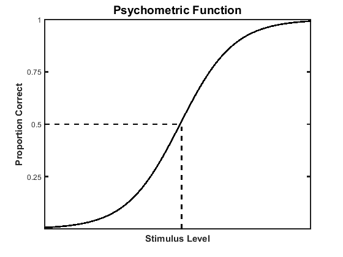{ width=38% } 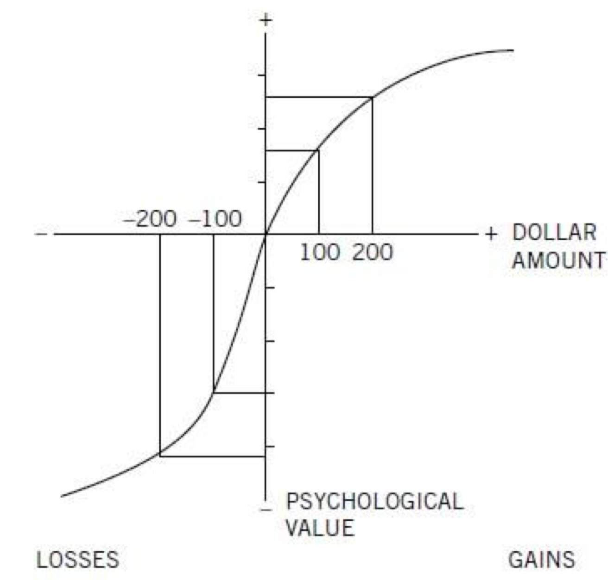{ width=30% }

## RLHF  --  reward models

The standard recipe for aligning to preferences [@Ouyang2022]:

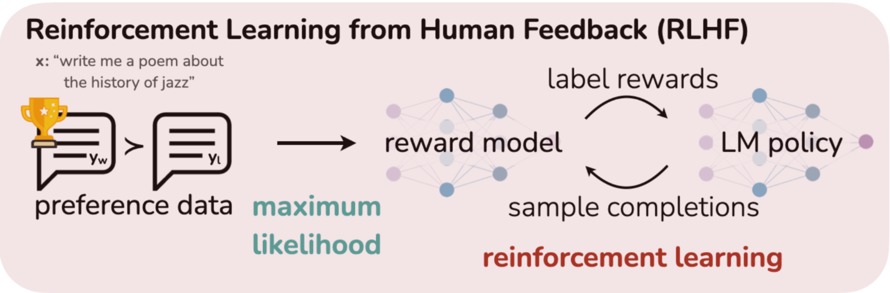{ width=55% }

1. gather **preference data**  --  human-annotated responses
2. fit a **reward model** $r(x,y)$ to those preferences
3. **RL** to maximise the learned reward

::: {.fragment}
A separate reward model **and** an RL loop  --  can we drop both?
:::

## DPO  --  the policy *is* the reward model

DPO [@Rafailov2023] drops both, optimising the policy directly

::: {.incremental}
* RLHF objective  --  reward minus a KL leash:
$$\max_{\pi_\theta}\ \mathbb{E}_{y\sim\pi_\theta}\!\left[r(x,y)\right]\ -\ \beta\,\mathrm{KL}\!\left(\pi_\theta \,\|\, \pi_{\text{ref}}\right)$$

* the optimum has a **closed form**:
$$\pi_\theta(y|x)=\tfrac{1}{Z(x)}\,\pi_{\text{ref}}(y|x)\,\exp\!\big(r(x,y)/\beta\big)$$

* invert it  --  *a policy already is a reward model*:
$$r_\theta(x,y)=\beta\log\frac{\pi_\theta(y|x)}{\pi_{\text{ref}}(y|x)}+\beta\log Z(x)$$

* plug into **Bradley-Terry** $\,p(y_+\!\succ y_-)=\sigma\!\big(r(x,y_+)-r(x,y_-)\big)$: the intractable $Z(x)$ **cancels**
:::

::: {.fragment}
Maximum likelihood on **paired** data  --  no reward model, no RL loop
:::

## Pointwise preference {auto-animate="true" auto-animate-easing="ease-in-out"}

:::: {.columns}
::: {.column width=50%}

::: {data-id="fig_d"}

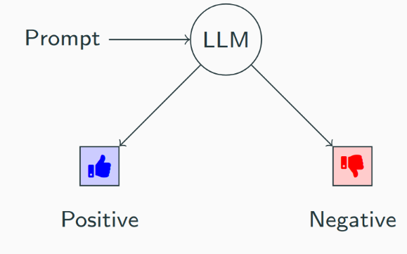{ width=80% }

:::

::: {data-id="eq1"}
$$\fbox{$\color{blue}{\log\left( \frac{\pi_{\theta}(y_+|x)}{\pi_{\text{ref}}(y_+|x)} \right)} \geq \color{red}{\log\left( \frac{\pi_{\theta}(y_-|x)}{\pi_{\text{ref}}(y_-|x)} \right)} $}$$
:::

:::
::: {.column width=50%}

::: {.incremental}
Problems with Bradley-Terry pointwise preference:

1. **paired** positive and negative responses are needed for each prompt
2. provided pairs are sparse (only a fraction of all possible pairs)

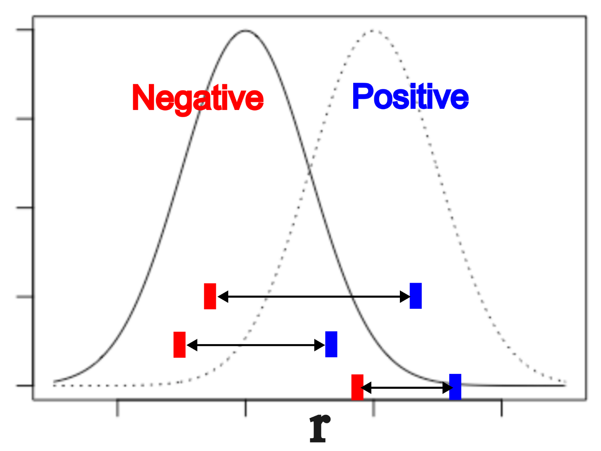{ width=60% }

* what we want is to compare the **full distributions**
:::

:::
::::

## Distributional preference {auto-animate="true" auto-animate-easing="ease-in-out"}

:::: {.columns}
::: {.column width=50%}

::: {data-id="fig_d"}

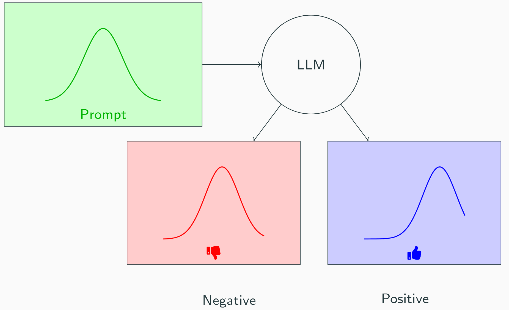{ width=100% }

:::

::: {data-id="eq1"}
$$\fbox{$\color{blue}{\log\left( \frac{\pi_{\theta}(y_+|x_+)}{\pi_{\text{ref}}(y_+|x_+)} \right)} \underset{\text{FSD}}{\succcurlyeq} \color{red}{\log\left( \frac{\pi_{\theta}(y_-|x_-)}{\pi_{\text{ref}}(y_-|x_-)} \right)} $}$$
:::

::: {.fragment}
* no need for **paired** positive and negative answers
* "all" negative samples compared to all positives
:::

:::
::: {.column width=50%}

* **Goal:** Compare whole distribution of negative responses and distribution of positive responses

Distributional comparison
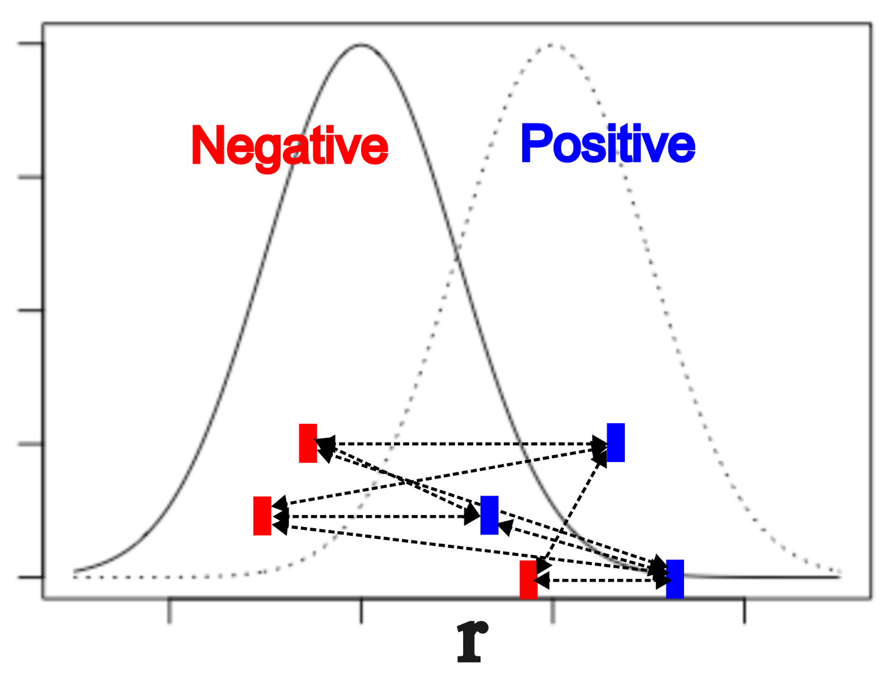{ width=60% }

:::
::::

## AOT unpaired pseudocode

:::: {.columns}
::: {.column width=50%}

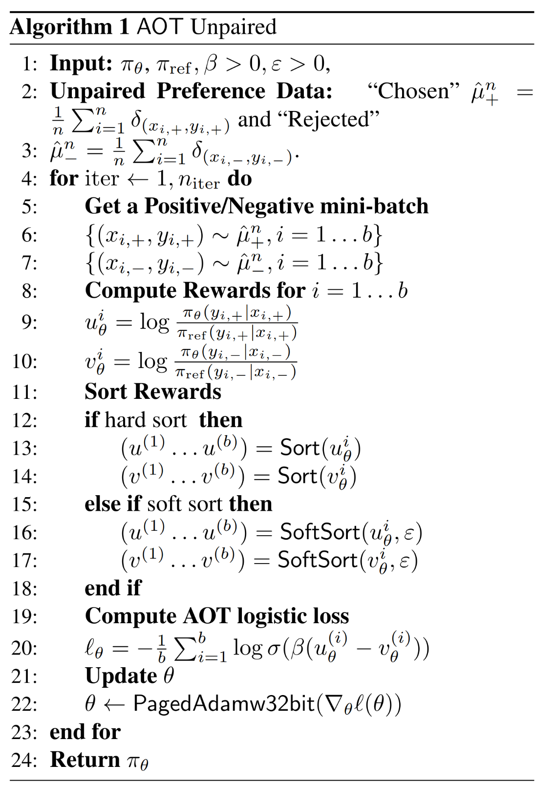{ width=75% }

:::
::: {.column width=50%}

Pointwise pairwise comparisons
{ width=60% }

::: {.fragment}

Distributional comparison
{ width=60% }

:::

:::
::::

## Empirical results on Merlinite 7B alignment

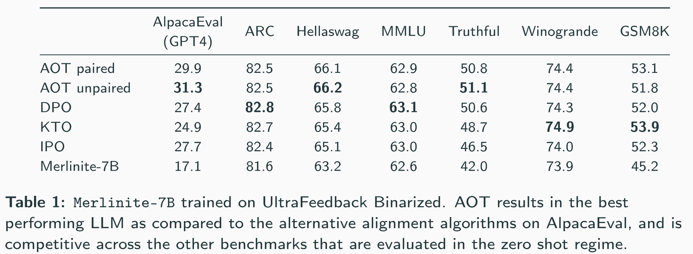{ width=90% }

* SOTA in the 7B family  --  Open LLM Benchmark, AlpacaEval 2.0 LC win-rate

## Safety with preference optimization

* preference-optimisation methods align LLMs on a **safety** dataset
* *LLaMa Guard* [@Inan2023]  --  a classifier that labels each response safe / unsafe
* scored on the **ALERT** red-teaming benchmark [@Tedeschi2024]

![Benchmarking alignment methods for safety [@Alami2024]  --  safety score = fraction of ALERT red-teaming prompts answered safely per LLaMa Guard](2026-TufaLabs_files/img/aot_safe.png){ width=90% }

::: {.fragment}
each bar is one preference-optimisation method  --  **AOT** is among the safest
:::

# Reasoning and tool calling workflows

## RL in post-training for reasoning

::: {.incremental}
* **DeepSeek-R1** (Jan 2025) sparked the reasoning boom driven by large-scale RL with *verifiable rewards*
* Qwen2.5-Base, DeepSeek-V3-Base  --  *"aha moments"* and self-reflection appear without RL
* Budget forcing, (s1 @Muennighoff2025)  --  sampling long enough from a base model surfaces reasoning
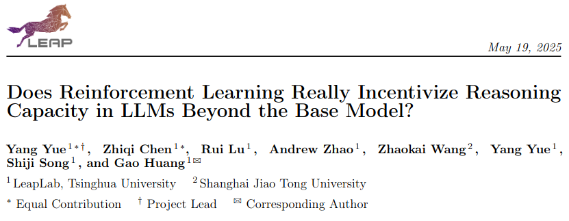{ width=50% }
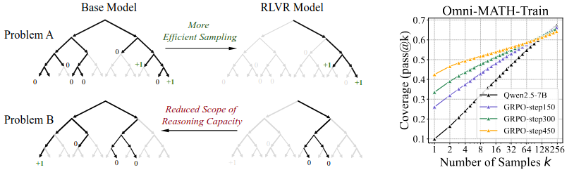{ width=50% }
:::

## Calling cognitive tools

* **Structured reasoning**  --  discrete operations coordinated by a central controller, à la cognitive architectures (ACT-R) [@Anderson2004]

::: {.fragment}
* **What if the sub-calls were *cognitive* operations the model runs on itself?**

* **External tools**  --  functional modularity: hand a sub-task to a specialized module (search, code, calculator); the model only orchestrates
  * 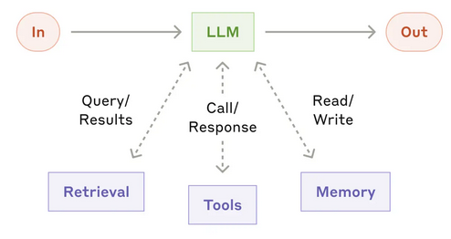{ width=45% }
:::

## Cognitive prompting vs cognitive tools

:::: {.columns}
::: {.column width=30%}

* Cognitive prompting
  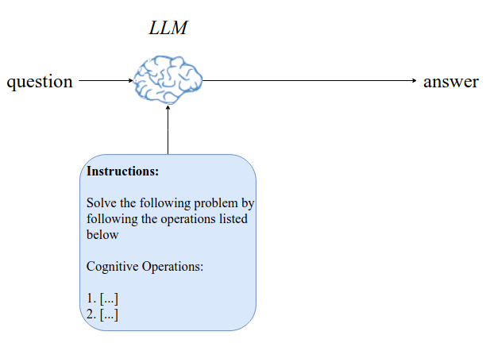{ width=100% }

:::
::: {.column width=70%}

* Cognitive *tools*
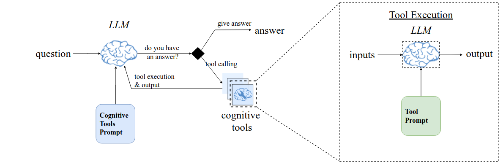{ width=100% }

:::
::::

## Four cognitive tools

| Tool | Cognitive role | ACT-R / cog-arch analogue |
|---|---|---|
| `understand question` | decompose, find primitives | goal management |
| `recall related` | analogical reasoning | declarative retrieval |
| `examine answer` | self-reflection | meta-monitoring |
| `backtracking` | branch search (MCTS-style) | conflict resolution |

::: {.fragment}
Each tool is a **sandboxed sub-call of the same LLM**: independent context, output folded back into the orchestrator $\to$ reasoning emerges from **composing** these operations

:::

## Cognitive tools vs cognitive prompting performance

* Cognitive tools on Smolbenchmarks
  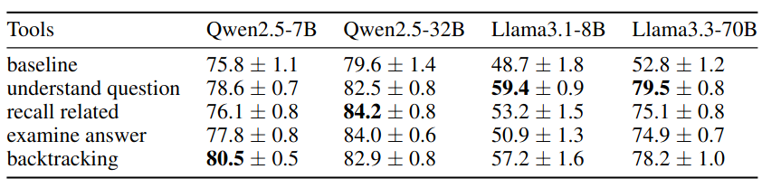{ width=80% }

* Cognitive tools vs cognitive prompting on Smolbenchmarks
  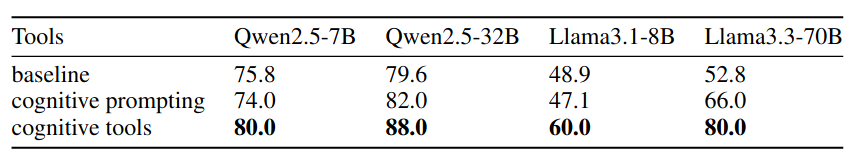{ width=80% }

## Main results

:::: {.columns}
::: {.column width=60%}
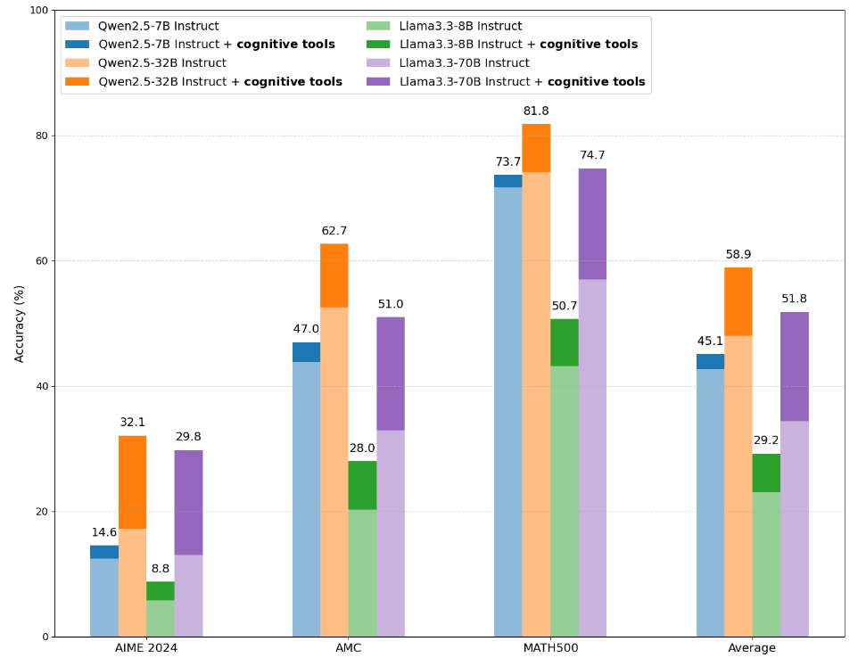{ width=100% }
:::
::: {.column width=35%}
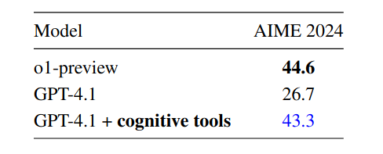{ width=100% }
:::
::::

## Cognitive tools  --  takeaways

* **Elicitation, not instillation**  --  reasoning was already latent; structure surfaces it without RL
* **Modularity beats monolithic**  --  sandboxed sub-calls reduce interference; tool-call frequency self-regulates with task difficulty
* **Targeted inference-time compute**  --  extra calls only where the model judges them necessary

::: {.fragment}
*Cognitive tools* decomposed *reasoning* into sub-operations.

How about *vision*: can we carve specialized circuits into the model's perceptual processing as well?
:::

# Visual reasoning

## Motivation -- Thinking with images

[OpenAI: *Thinking with Images*](https://openai.com/index/thinking-with-images)

* integrate images directly into the reasoning chain; think *through* visual content, not just about it^[thanks to N. Avogaro for slides]

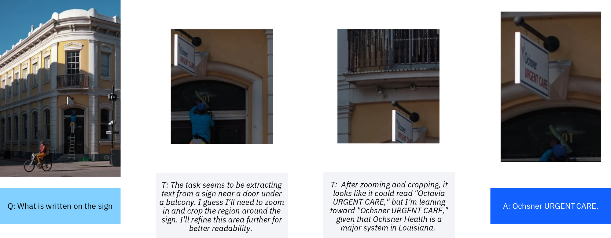{ width=90% }

## Failure modes

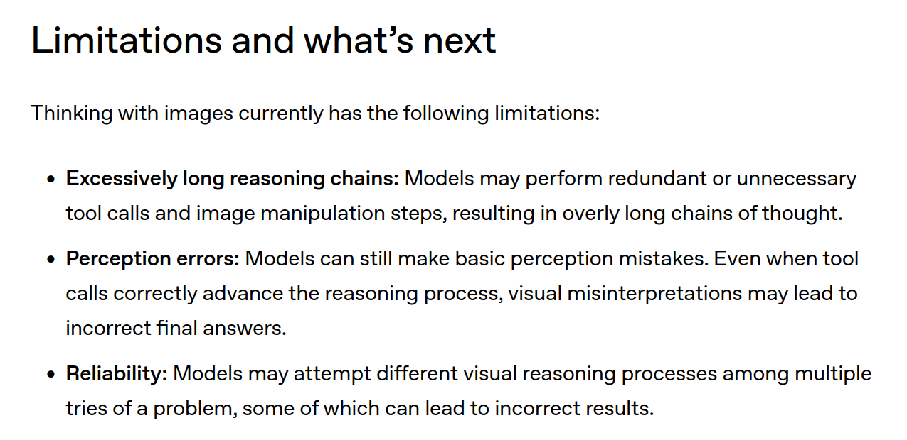{ width=70% }

## Failure modes

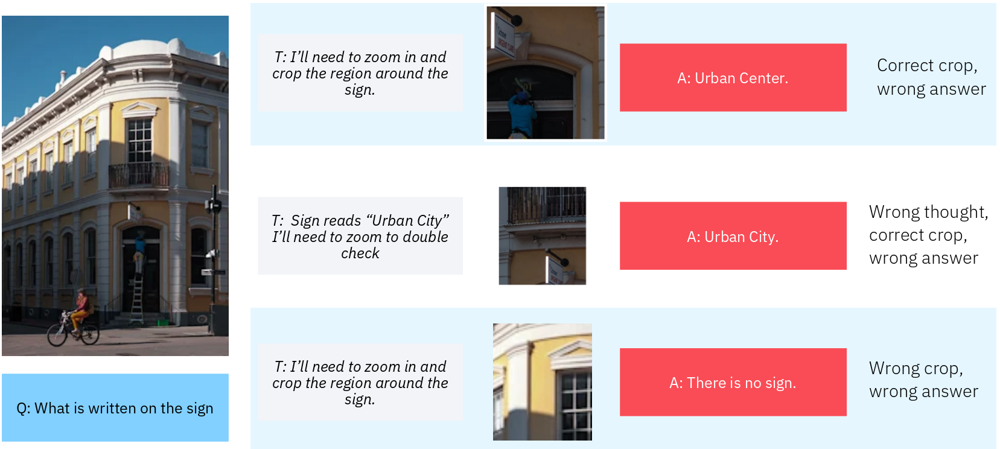{ width=100% }

## One root cause  --  monolithic perception + reasoning

* All three failures trace to **perception and reasoning fused into a single CoT pass**
* But these are *different computations*  --  locating relevant regions vs. reasoning over them
* Different computations should be **separated** and **scaled independently**
* Modularity again  --  the same lesson as Cognitive Tools, now in pixels

::: {.fragment}
How should we carve it? The brain already separates these circuits

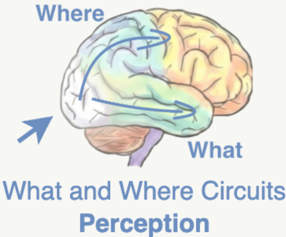{ height=260px }
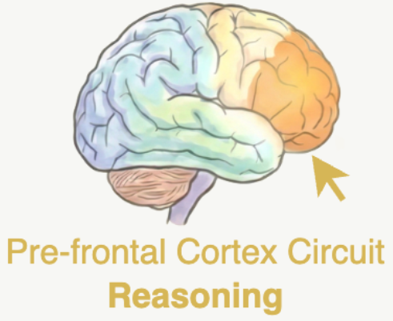{ height=260px }

:::

## Does good perception suffice?

:::: {.columns}
::: {.column width=50%}

**Foveated vision**  --  the retina samples a high-acuity fovea in a low-res periphery; the crop is the **fovea**, the downscaled image the periphery

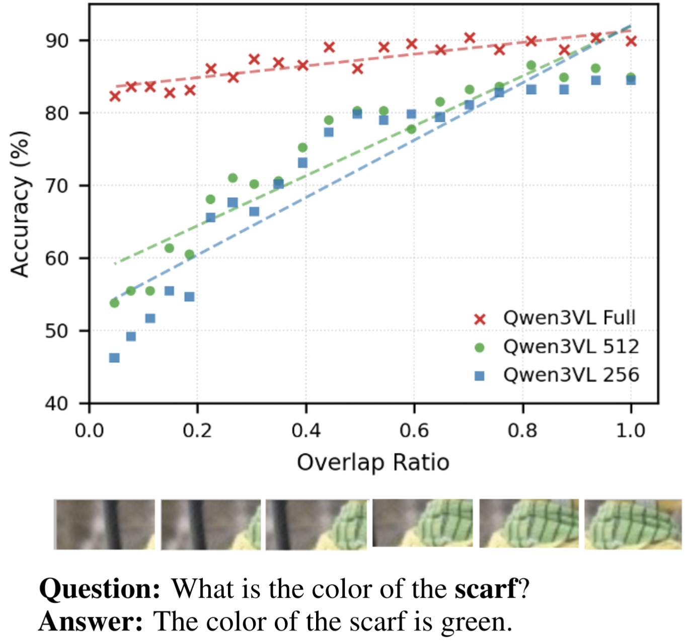{ height=560px }

:::
::: {.column width=50%}

**Setup** -- on V\*, feed the **downscaled** image + a crop; vary the crop's *overlap* with the ground-truth region

::: {.fragment}
* accuracy rises with overlap ratio
* the drop is steepest at low resolution
:::

::: {.fragment}
**Perception on low-res converges to full resolution**

Accurate perception compensates for lost global detail
:::

::: {.fragment}
**This decides the modules**

* **Perception**  --  localise the relevant region; this is what must be accurate
* **Reasoning**  --  needs only the crop + a cheap global pass, not full resolution
* the two have *different resolution needs*  --  so split them, and scale each on its own
:::

:::
::::

## SPARC architecture

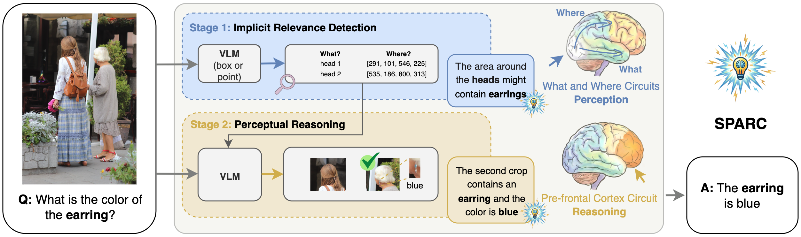{ width=100% }

* **Stage 1**  --  Implicit Relevance Detection (IRD)
  - low-res image + question $\to$ boxes or points

* **Stage 2**  --  Perceptual Reasoning
  - original low-res image + IRD high-res crops $\to$ answer

## SPARC  --  main results

:::: {.columns}
::: {.column width=50%}

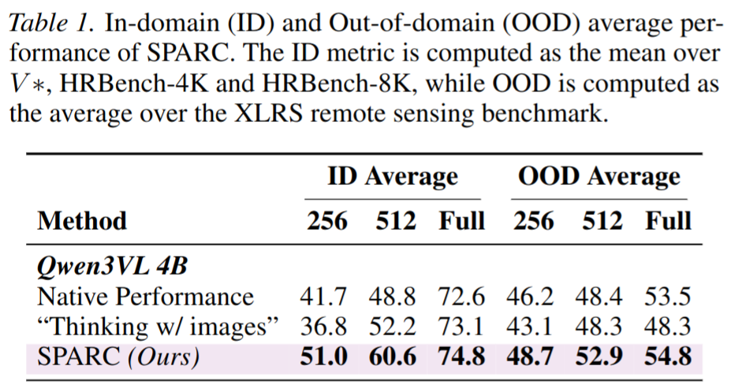{ width=100% }

* **Full res**: all comparable, but expensive
* **256 px**: native collapses, thinking-with-images drops *below* it; **SPARC degrades gracefully (51.0)**
* gains carry **out-of-domain** to XLRS

:::
::: {.column width=50%}

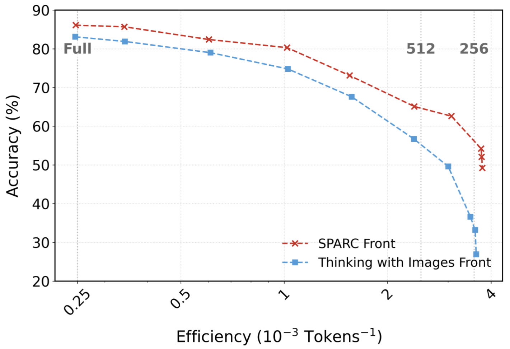{ width=100% }

* axis: **right = fewer tokens** (Full $\to$ 512 $\to$ 256)
* SPARC's frontier **dominates** at every budget
* same accuracy, fewer tokens  --  gap widens where it is cheap and hard

:::
::::

## Test-time scaling perception

Decoupled circuits $\to$ asymmetric scaling through **two independent compute knobs**

:::: {.columns}
::: {.column width=25%}

**Perception**  --  scale by *self-consistency*

* $N$ stochastic IRD rollouts, fused by **Weighted Box Fusion**
* cheap: boxes refined in *text space*, image KV-cache **shared across rollouts**
* gains over 1-shot SPARC
:::
::: {.column width=50%}

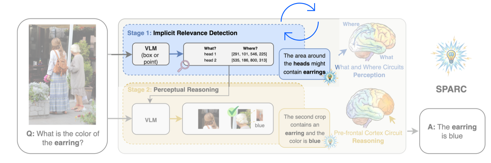{ width=90% }

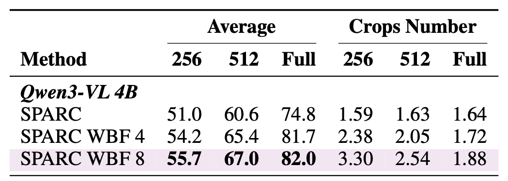{ width=80% }

:::
::: {.column width=16%}

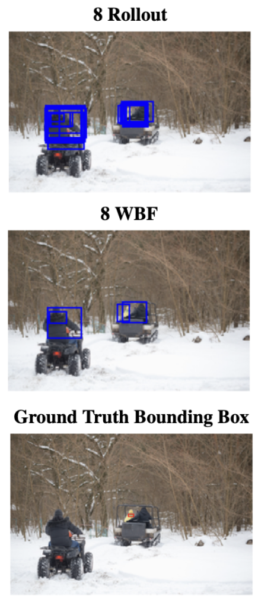{ width=100% }

:::
::::

## Disjoint finetuning  --  no catastrophic forgetting

Decoupled circuits $\to$ each can be finetuned *independently* **without catastrophic forgetting** of the other

:::: {.columns}
::: {.column width=30%}

**Swap in a better circuit**

* finetune **perception** *or* **reasoning** alone
* trained on **synthetic data**
* the untouched circuit is **preserved**
* a stronger perceptual **LoRA** (object detector) **dropped in at test time**
:::
::: {.column width=70%}

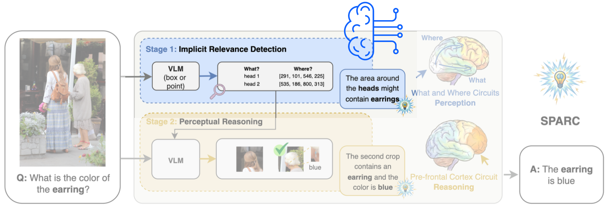{ width=60% }

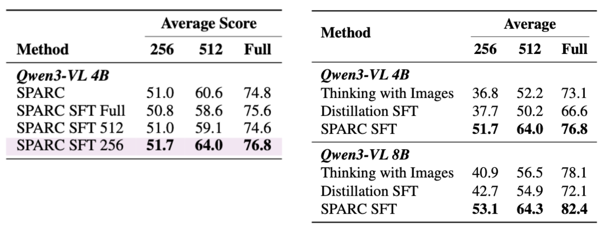{ width=80% }

:::
::::

# Conclusions

## Common threads

* **The brain as blueprint**  --  an existence proof and a prior that narrows the search
* **Modularity & compositionality over monolith**  --  specialized parts that *compose* (e.g.\ sandboxed sub-calls chained into reasoning, perception $\to$ reasoning stages)  --  easier to scale, inspect, and recombine

::: {.fragment}
**Structure over scale**  --  sounds *[anti-Bitter-Lesson](http://www.incompleteideas.net/IncIdeas/BitterLesson.html)*

...*yet,* more and more *structure* is being engineered *around* the model in the "**agentic harness** era": specification docs, structured reasoning frameworks, context engineering, tools, skills, sub-agents (modularity)
:::

::: {.fragment}

](2026-TufaLabs_files/img/brockman-tweet.png){ width=36% }

:::

## Future directions  --  metacognition

The next step: the model turns structure on its **own** computation  --  *monitoring* and *controlling* itself (a prefrontal hallmark)

:::: {.columns}
::: {.column width=60%}

::: {.fragment fragment-index=1}
* **Metacognitive monitoring**  --  the model assesses its own state; e.g. *uncertainty estimation*  --  knowing what it knows
:::

::: {.fragment fragment-index=2}
* **Metacognitive control**  --  the model regulates its own mechanisms; e.g. [*GazeVLM*](https://arxiv.org/abs/2605.07817): emits **gaze tokens** that steer its own self-attention top-down, no tool calls
:::

::: {.fragment fragment-index=3}
From carving structure *into* the model, to the model **steering its own** structure
:::

:::
::: {.column width=32%}

::: {.fragment fragment-index=1}
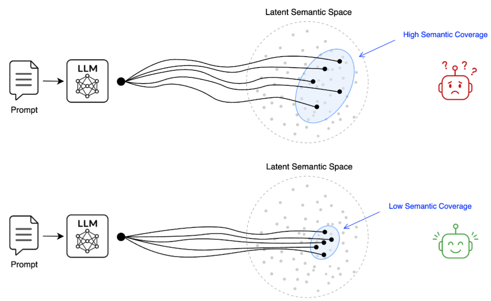{ width=90% }
:::

::: {.fragment fragment-index=2}
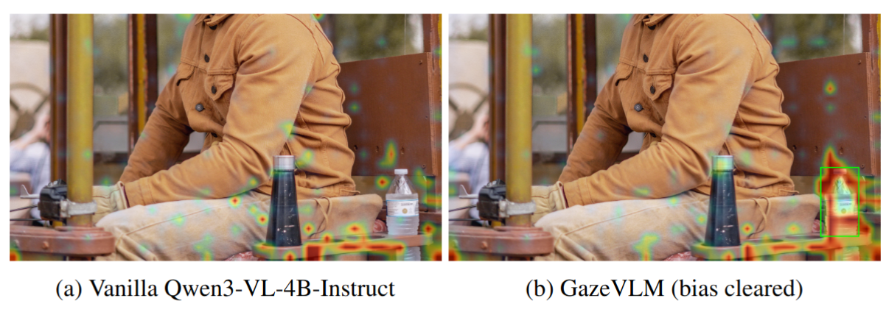{ width=90% }
:::

:::
::::

##

Thank you

 

📧 [mrg@zurich.ibm.com](mailto:mrg@zurich.ibm.com)

 

**Papers**

* Melnyk, Mroueh, Belgodere, Rigotti, Nitsure, Yurochkin, Greenewald, Navratil, Ross
   [**AOT**: Distributional Preference Alignment of LLMs via Optimal Transport](https://proceedings.neurips.cc/paper_files/paper/2024/hash/bce96750dcb64f3257ceabadf0b9c9bf-Abstract-Conference.html)  --  *NeurIPS 2024*
* **Brown Ebouky**, Bartezzaghi, Rigotti
   [**Cognitive Tools**: Eliciting Reasoning in Language Models with Cognitive Tools](https://arxiv.org/abs/2506.12115)  --  *NeurIPS 2025*
* **Niccolò Avogaro**, Debnath, Mi, Frick, Wang, He, Hua, Schindler, Rigotti
   [**SPARC**: Separating Perception and Reasoning Circuits for Test-time Scaling of VLMs](https://arxiv.org/abs/2602.06566)  --  *ICML 2026*

## References
